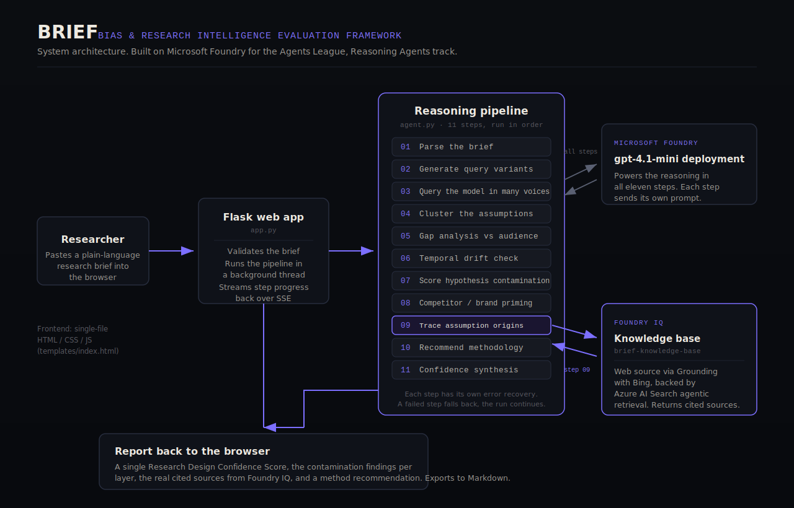

# BRIEF

### Bias & Research Intelligence Evaluation Framework

**An agent that audits what AI already assumes about a research topic, before any fieldwork begins.**

Built for the Microsoft Agents League hackathon, Reasoning Agents track, on Microsoft Foundry.

---

## Why I built this

I am a market researcher. A growing part of my job, and my colleagues' jobs, now starts with an AI model: asking it to summarise a category, suggest hypotheses, or sketch an audience before we design a study.

I kept noticing the same quiet failure. The model's answer is never neutral, and if you build research around it without realising that, you spend a lot of money confirming an assumption instead of discovering anything. I wanted a tool that made that risk visible before the work started, written by someone who actually sits in the research chair rather than guessing at what researchers need. BRIEF is that tool.

---

## The problem

When a researcher leans on an AI model to frame a topic, the model reflects whatever dominated its training data: usually Western, urban, commercial, English-language sources. Two things then go wrong. The research tends to confirm what the model already believed. And the respondents themselves have often been exposed to the same narratives, so even their answers echo the consensus back.

The result is expensive research that validates a starting assumption rather than discovering anything new. The contamination is invisible, because nobody mapped it.

BRIEF maps it. You paste in a research brief, and the agent works out what AI currently assumes about the topic, whose perspective dominates, which of the client's hypotheses are just AI consensus repeated back, where the picture is already out of date, and how to design the research so it finds something the model could not have told you.

---

## What it does

BRIEF takes a plain-language research brief and routes it through a multi-agent system of eleven specialised agents, coordinated by an orchestrator. The output is a structured report a researcher can act on, ending in a single Research Design Confidence Score that says how likely the study, as framed, is to surface genuine insight rather than echo the model.

The report covers:

- **What AI assumes** about the topic, drawn from querying the model in several consumer voices and persona variants
- **What AI misses** - the perspectives it over-weights, the ones it skips, and the questions nobody is asking
- **Client hypothesis contamination** - scoring how much of what the client "knows" came from AI rather than the market
- **Temporal drift** - which assumptions are likely stale given the model's training cutoff
- **Brand priming** - which brands the model raises unprompted, that respondents have probably already absorbed
- **Where the assumptions come from** - a source-origin analysis grounded in live web sources via Foundry IQ, with real citations
- **How to research it** - methodology recommendations built around the specific gaps found

---

## Architecture



## How it works: a multi-agent system

BRIEF is a multi-agent system. An orchestrator (`run_brief`) takes the brief and routes it through eleven specialised agents, each with a single job, its own domain-expert instructions, and its own structured output contract. Each agent hands its findings to the next, so the system as a whole decomposes a hard, open-ended problem ("is this research design contaminated?") into focused tasks that build on one another.

The design follows three reasoning patterns the track describes:

- **Role-based specialisation** - each agent owns one part of the problem (parsing, querying, contamination scoring, source archaeology, and so on) rather than one model trying to do everything at once.
- **Planner then executors** - the first agents parse the brief and plan how the topic should be probed; later agents execute that plan against the model and the live web.
- **Critic / synthesis** - the final agent reviews every other agent's output and produces a single Research Design Confidence Score, acting as a verifier over the whole run rather than adding another isolated finding.

```
Research brief
   |
   v
ORCHESTRATOR  (run_brief: routes the brief, passes state between agents)
   |
   1   PARSE agent          structure the brief: category, audience, objective, hypotheses
   2   GENERATE agent       work out how real people actually query this topic
   3   QUERY agent          probe the model in 6 base voices + 4 persona variants
   4   CLUSTER agent        find the dominant assumptions across every response
   5   GAP agent            compare the AI picture against the real target audience
   6   DRIFT agent          flag assumptions likely out of date
   7   CONTAMINATION agent  score each client hypothesis against AI consensus
   8   COMPETITOR agent     surface brands the model raises unprompted
   9   ARCHAEOLOGY agent    trace where the assumptions come from   [grounded by Foundry IQ]
  10   METHODOLOGY agent    recommend how to research around the gaps
  11   SYNTHESIS agent      review all findings into one design-confidence score
   |
   v
Structured report
```

Each agent runs inside its own error recovery, so if one agent fails it returns a safe fallback and the orchestrator continues the run rather than the whole system breaking.

---

## Stack

- **Microsoft Foundry** project with a `gpt-4.1-mini` deployment powering all eleven agents
- **Foundry IQ** knowledge base with a web knowledge source (Grounding with Bing), backed by Azure AI Search agentic retrieval, grounding the archaeology agent in real cited sources
- **Python** orchestrator and agent definitions (`agent.py`, `foundry_iq.py`)
- **Flask** backend (`app.py`) streaming each agent's progress live over server-sent events
- **Vanilla HTML, CSS and JavaScript** frontend (`templates/index.html`) - single file, no framework

---

## How Foundry IQ is used

The archaeology agent, which traces where a topic's assumptions originate, is the IQ-grounded agent, and it is the heart of what makes BRIEF more than a clever prompt chain.

Instead of letting the model guess where a topic's assumptions originate, BRIEF queries a Foundry IQ knowledge base configured with a web knowledge source and medium retrieval reasoning effort. The agentic retrieval engine plans subqueries, searches the live web, and returns synthesised findings together with source references. BRIEF feeds those grounded findings into its analysis and shows the real, clickable citations in the report.

This matters for research integrity. A claim about whose voices shaped a category should itself be traceable to sources, not asserted by the same model whose bias we are trying to audit. Grounding the origin analysis in live, cited web sources is what lets a researcher trust and defend it.

If retrieval is ever unavailable, the step falls back to model-only analysis, so the experience never breaks during a demo or in front of a client.

---

## Reliability and safety

- Every reasoning step has its own error recovery; one failed step cannot break the run
- Foundry IQ retrieval fails soft to model-only analysis
- Briefs are validated and length-capped before processing
- Sessions are cleaned up on a TTL and every run has a hard timeout
- The interface uses the Atkinson Hyperlegible typeface and honours reduced-motion preferences, so the tool is usable by researchers with dyslexia or motion sensitivity

---

## Built during the hacking window

BRIEF was built new for this hackathon. The idea grew out of a problem I keep running into in my own research work, but the multi-agent system, the orchestrator, the Foundry deployment, the Foundry IQ grounding, the confidence-scoring agent, and the entire interface were all built during the event.

---

## Running it locally

```bash
pip install -r requirements.txt
```

Create a `.env` file in the project root:

```
AZURE_PROJECT_ENDPOINT=https://your-resource.services.ai.azure.com/
AZURE_OPENAI_ENDPOINT=https://your-resource.openai.azure.com
AZURE_MODEL_DEPLOYMENT=gpt-4.1-mini
AZURE_API_KEY=your_key

AZURE_SEARCH_ENDPOINT=https://your-search.search.windows.net
AZURE_SEARCH_KEY=your_search_admin_key
FOUNDRY_KNOWLEDGE_BASE=brief-knowledge-base
```

Then start the app:

```bash
python app.py
```

Open `http://localhost:5000`, paste in a research brief, and run the analysis. Watch the eleven steps stream live, then read the report.

The Foundry IQ web source requires an Azure AI Search service on Basic tier or higher, with a knowledge base that includes a web knowledge source and an attached chat-completion model.

---

## Try it with this brief

> We are conducting research for a global beverage brand exploring consumer attitudes toward health and wellness drinks among Gen Z adults aged 18 to 25. The client believes Gen Z prioritises natural ingredients and sustainability above taste and price. Research will be conducted across the UK, US, and India.

BRIEF will flag the Anglo-centric framing, score the client's "natural and sustainable" hypothesis for contamination, surface the brands the model raises unprompted, and ground its source analysis in live web citations about the beverage category.

---

## Roadmap

Explored during the event and deferred for after submission:

- **Multi-market divergence** - running the chain per market and surfacing where the AI picture diverges across geographies
- **Living brief** - re-running the audit as a brief evolves, tracking how contamination changes over time
- **Fieldwork calibration** - comparing the AI assumptions against real fieldwork results to score how well BRIEF predicted the gaps

---

## A note on purpose

BRIEF was built for market research, but the same problem reaches anywhere people use AI to frame a question before investigating it: healthcare, public policy, financial inclusion. Wherever a study's starting assumptions quietly come from a model rather than the world, the findings risk confirming the model instead of the reality. Making those assumptions visible before the work begins is a small contribution to research integrity.
